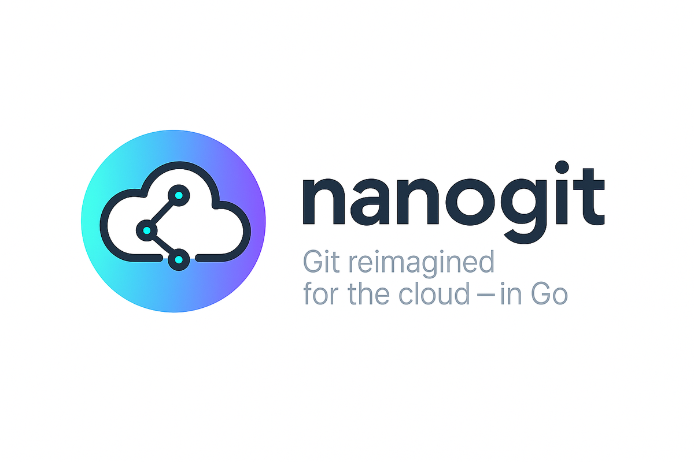

<div align="center">
  
</div>

<p align="center">
  <a href="https://github.com/grafana/nanogit/releases"></a>
  <a href="LICENSE.md"></a>
  <a href="https://goreportcard.com/report/github.com/grafana/nanogit"></a>
  <a href="https://godoc.org/github.com/grafana/nanogit"></a>
  <a href="https://codecov.io/gh/grafana/nanogit"></a>
</p>

<p align="center">
  📚 <strong><a href="https://grafana.github.io/nanogit">Read the full documentation at grafana.github.io/nanogit</a></strong>
</p>

## What is nanogit?

nanogit is a lightweight Git client library for Go, built for services that read from and write to Git repositories over HTTPS — with no local clone, no `.git` directory, and no `git` binary. It speaks the [Git Smart HTTP Protocol v2](https://git-scm.com/docs/protocol-v2) directly, so it works with GitHub, GitLab, Bitbucket, Gitea, and any other server that supports protocol v2.

Grafana built nanogit to power [Git Sync](https://grafana.com/docs/grafana/latest/as-code/observability-as-code/git-sync/), which syncs dashboards with tenants' own Git repositories from inside Grafana's multitenant backend — a workload where cloning every repository to disk is not an option. Read the full story in [Why nanogit exists](docs/why-nanogit.md).

- **Stateless** — reads and writes Git objects directly over HTTPS; nothing is persisted locally, so there is no per-repository state to store, clean up, or keep consistent across replicas
- **Works with any protocol v2 server** — one code path for GitHub, GitLab, Bitbucket, Gitea, and self-hosted servers; token-based auth, no SSH key management
- **Essential operations** — refs, blobs, trees, commits, diffs, staged writes, and shallow clones with glob-based path filtering
- **Memory-efficient** — streaming packfile processing and configurable memory/disk/auto writing modes for bulk operations
- **Fast** — orders of magnitude faster and leaner than a full Git implementation for common server-side operations ([benchmarks below](#how-is-it-different-from-go-git))
- **Commit signing** — sign commits with GPG, SSH, or S/MIME keys
- **Pluggable** — object storage (caching) and [retry policies](https://grafana.github.io/nanogit/architecture/retry) are injected via context, with sensible defaults

## When should I use it?

Use nanogit when your code runs **server-side and talks to Git over HTTPS**:

- **GitOps and as-code services** — sync configuration, dashboards, or manifests between your application and users' repositories
- **Bots and automation** — commit generated files, open changes, or mirror content without shelling out to `git`
- **Multitenant platforms** — operate on thousands of repositories without maintaining a checkout per tenant
- **Serverless and containers** — environments with little or no persistent disk
- **CI tooling** — fetch only the subpaths you need from large repositories using path-filtered, shallow clones

## When should I not use it?

nanogit is deliberately narrow. Reach for the `git` CLI or [go-git](https://github.com/go-git/go-git) instead when you need:

- **Local development workflows** — working trees, the index, `.git` directories, or repositories on disk
- **Full Git functionality** — merges, rebases, blame, hooks, or Git configuration management
- **Other transports** — SSH, `git://`, or local file access; nanogit is HTTPS-only
- **Protocol v1 or "dumb" HTTP servers** — nanogit requires Smart HTTP protocol v2 and does not fall back. Notably, **Azure DevOps / Azure Repos only speaks v1 and is not supported.** Run [`nanogit check`](https://grafana.github.io/nanogit/getting-started/server-compatibility/) against a new provider before integrating
- **Signature verification** — nanogit can sign commits but does not verify signatures
- **Fine-grained file permissions** — all files are written with mode 0644

See [Why Git Protocol v2 Only?](https://grafana.github.io/nanogit/architecture/protocol-v2) for the rationale behind the strictest of these constraints.

## How is it different from go-git?

[go-git](https://github.com/go-git/go-git) is a mature, full-featured Git implementation. nanogit trades that breadth for a small, stateless core optimized for cloud services:

| Feature        | nanogit                                                 | go-git                 |
| -------------- | ------------------------------------------------------- | ---------------------- |
| Protocol       | HTTPS only (Smart HTTP v2)                              | All protocols          |
| Storage        | Stateless; pluggable object storage and writing modes   | Local disk operations  |
| Cloning        | Shallow, with glob-based path filtering                 | Full repository clones |
| Scope          | Essential operations only                               | Full Git functionality |
| Use case       | Cloud services, multitenant backends                    | General purpose        |
| Resource usage | Minimal footprint                                       | Full Git features      |

Because it never materializes a full repository, nanogit is dramatically faster and lighter for typical server-side operations. From the July 2025 run of the [benchmark suite](perf/), on the XL repository tier (15,000 files, 3,000 commits), nanogit vs go-git:

| Scenario             | Speed         | Memory usage |
| -------------------- | ------------- | ------------ |
| CreateFile (XL repo) | 281.6x faster | 198.4x less  |
| UpdateFile (XL repo) | 297.3x faster | 189.2x less  |
| DeleteFile (XL repo) | 280.5x faster | 200.5x less  |
| GetFlatTree (XL repo) | 260.8x faster | 154.3x less  |

(go-git did not complete the bulk-create and commit-comparison scenarios in that run, so no multipliers are quoted for them; nanogit bulk-created 1,000 files in ~103ms.) See the [full performance report](perf/LAST_REPORT.md) and the [performance analysis](docs/architecture/performance.md) for methodology and complete results.

## Is it production-ready?

**Yes.** nanogit is the Git engine behind [Git Sync](https://grafana.com/docs/grafana/latest/as-code/observability-as-code/git-sync/) in [grafana/grafana](https://github.com/grafana/grafana), reading and writing dashboards across tenants' repositories in production, and the default Git driver in [grafana-bench](https://github.com/grafana/grafana-bench). See [who uses nanogit](docs/why-nanogit.md#who-uses-nanogit).

Releases follow [semantic versioning](https://semver.org/): the v1 API is stable, and breaking changes only land in major versions. The project is actively developed by Grafana Labs.

## Try it in 5 minutes

Install the library (requires **Go 1.25+**):

```bash
go get github.com/grafana/nanogit@latest
```

Read a file from a repository, then commit and push a new one — no clone involved:

```go
package main

import (
	"context"
	"fmt"
	"os"
	"time"

	"github.com/grafana/nanogit"
	"github.com/grafana/nanogit/options"
)

func main() {
	if err := run(context.Background()); err != nil {
		fmt.Fprintln(os.Stderr, err)
		os.Exit(1)
	}
}

func run(ctx context.Context) error {
	// Any repository you can reach over HTTPS. Use a scratch repo to try the write path.
	client, err := nanogit.NewHTTPClient(
		"https://github.com/you/scratch-repo.git",
		options.WithBasicAuth("git", os.Getenv("GIT_TOKEN")),
	)
	if err != nil {
		return err
	}

	// Read a file straight from the server.
	ref, err := client.GetRef(ctx, "refs/heads/main")
	if err != nil {
		return err
	}
	commit, err := client.GetCommit(ctx, ref.Hash)
	if err != nil {
		return err
	}
	blob, err := client.GetBlobByPath(ctx, commit.Tree, "README.md")
	if err != nil {
		return err
	}
	fmt.Printf("README.md at %s is %d bytes\n", ref.Hash, len(blob.Content))

	// Stage a file, commit it, and push — entirely over HTTPS.
	writer, err := client.NewStagedWriter(ctx, ref)
	if err != nil {
		return err
	}
	if _, err := writer.CreateBlob(ctx, "hello/from-nanogit.txt", []byte("pushed without a checkout\n")); err != nil {
		return err
	}

	author := nanogit.Author{Name: "You", Email: "you@example.com", Time: time.Now()}
	committer := nanogit.Committer{Name: "You", Email: "you@example.com", Time: time.Now()}
	if _, err := writer.Commit(ctx, "Add from-nanogit.txt", author, committer); err != nil {
		return err
	}
	return writer.Push(ctx)
}
```

From here, the [Quick Start guide](https://grafana.github.io/nanogit/getting-started/quick-start/) covers cloning with path filtering, writing modes, retries, and authentication options.

### Try the CLI

nanogit ships a small CLI — primarily a testing and demonstration tool for the library. Install it with Go or grab a [pre-built binary](https://github.com/grafana/nanogit/releases/latest):

```bash
go install github.com/grafana/nanogit/cli/cmd/nanogit@latest

# Is this server compatible with nanogit?
nanogit check https://github.com/grafana/nanogit.git

# List refs, inspect trees, read and write files
nanogit ls-remote https://github.com/grafana/nanogit.git
nanogit cat-file https://github.com/grafana/nanogit.git main README.md
```

See the [CLI documentation](https://grafana.github.io/nanogit/getting-started/cli/) for all commands and platform-specific downloads.

## Documentation

Comprehensive documentation is available at **[grafana.github.io/nanogit](https://grafana.github.io/nanogit)**:

- **[Quick Start](https://grafana.github.io/nanogit/getting-started/quick-start/)** — reading, writing, cloning, retries, and authentication
- **[Server Compatibility](https://grafana.github.io/nanogit/getting-started/server-compatibility/)** — verify a Git server works with nanogit in four CLI commands
- **[Architecture](https://grafana.github.io/nanogit/architecture/overview/)** — design principles, [storage backends](docs/architecture/storage.md), [retry mechanism](docs/architecture/retry.md), and [performance](docs/architecture/performance.md)
- **[Why nanogit exists](docs/why-nanogit.md)** — the Git Sync story and who uses nanogit
- **[API Reference (GoDoc)](https://pkg.go.dev/github.com/grafana/nanogit)** — complete API documentation
- **[Changelog](https://grafana.github.io/nanogit/changelog/)** — version history and release notes

## Testing your integration

nanogit ships the tooling to test code that depends on it:

- **Unit tests** — generated mocks for the `Client` and `StagedWriter` interfaces, with [working examples](mocks/example_test.go)
- **Integration tests** — the [`gittest` package](gittest/README.md) spins up a real containerized Gitea server via Testcontainers: `go get github.com/grafana/nanogit/gittest@latest`

See the [Testing Guide](https://grafana.github.io/nanogit/testing-guide) for patterns and best practices.

## Contributing

We welcome contributions! Please see the [Contributing Guide](CONTRIBUTING.md) for how to submit pull requests, report issues, and set up your development environment. This project follows the [Grafana Code of Conduct](CODE_OF_CONDUCT.md).

## License

This project is licensed under the [Apache License 2.0](LICENSE.md).

## Security

If you find a security vulnerability, please report it according to [our security policy](https://github.com/grafana/.github/blob/main/SECURITY.md).

## Support

- GitHub Issues: [Create an issue](https://github.com/grafana/nanogit/issues)
- Community: [Grafana Community Forums](https://community.grafana.com)
